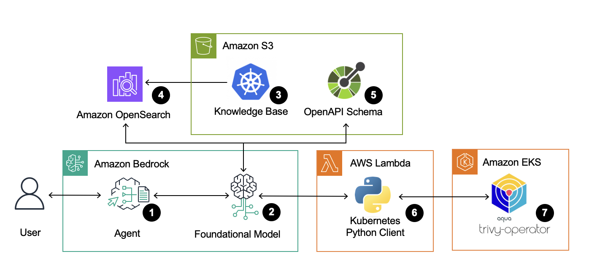
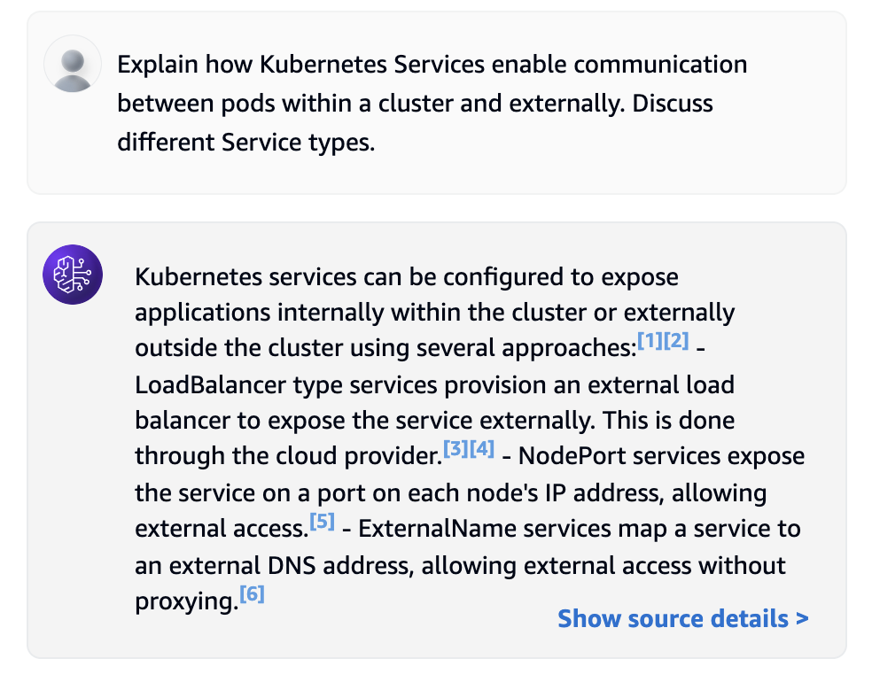
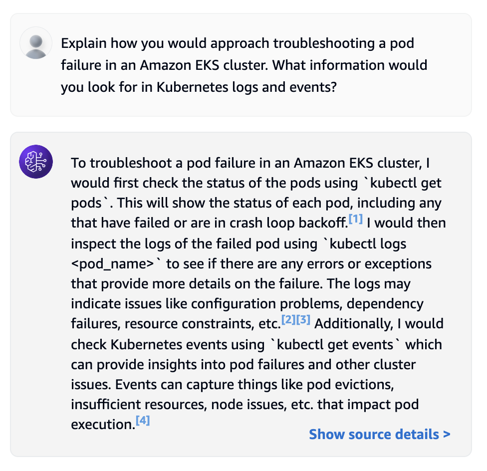
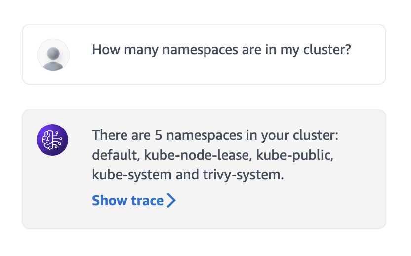
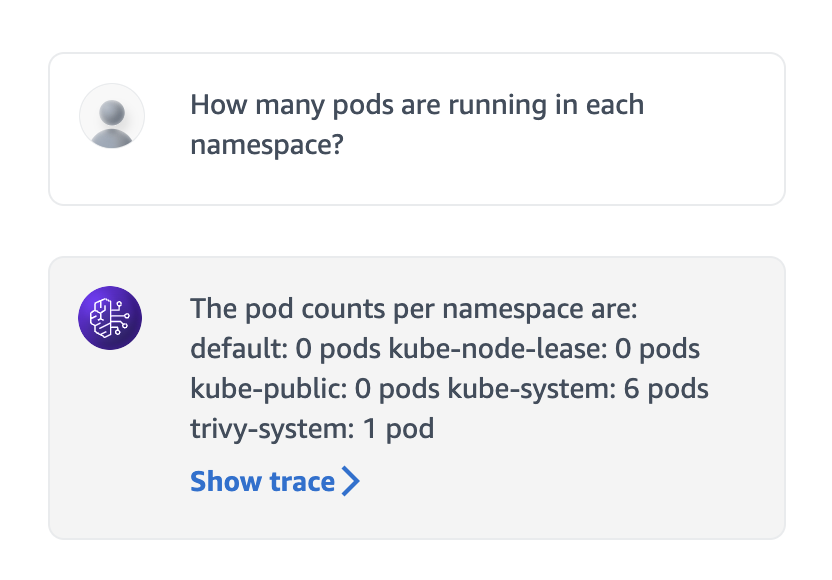
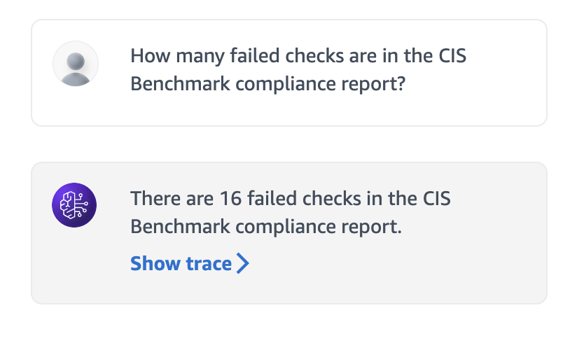
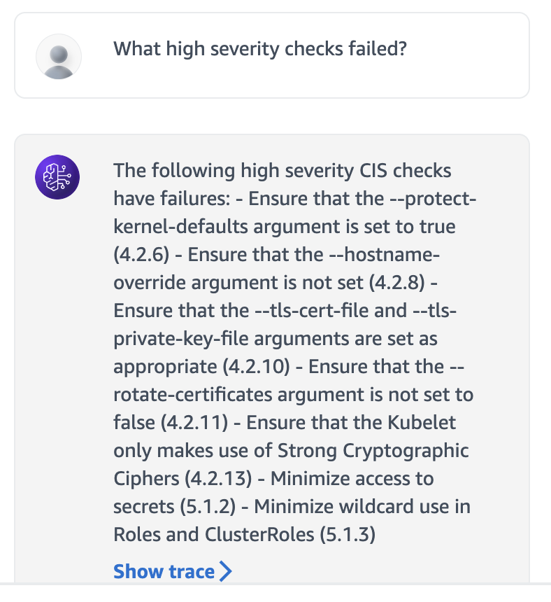

# Bedrock Agents For EKS

## Introduction
[Amazon Bedrock Agents](https://docs.aws.amazon.com/bedrock/latest/userguide/agents.html) are a feature within [Amazon Bedrock](https://docs.aws.amazon.com/bedrock/latest/userguide/what-is-bedrock.html) that allows you to build and configure software agents to automate tasks within your applications. These agents leverage [foundation models](https://docs.aws.amazon.com/bedrock/latest/userguide/models-supported.html) like [Anthropic Claude](https://docs.aws.amazon.com/bedrock/latest/userguide/model-parameters-claude.html) to help them make intelligent decisions about how to respond to conversational prompts. Using [retrieval augmented generation (RAG)](https://aws.amazon.com/what-is/retrieval-augmented-generation/), agents can respond to prompts using domain-specific data sources for more up-to-date authoritative information. Agents can also complete actions on your behalf by leveraging a combination of [OpenAPI schemas](https://docs.aws.amazon.com/bedrock/latest/userguide/agents-api-schema.html) and [AWS Lambda functions](https://docs.aws.amazon.com/bedrock/latest/userguide/agents-lambda.html) to intelligently access external systems.  

This post demonstrates how to configure [Amazon Bedrock Agents](https://docs.aws.amazon.com/bedrock/latest/userguide/agents.html) as a new natural language interface for [Amazon EKS clusters](https://docs.aws.amazon.com/eks/latest/userguide/clusters.html). By configuring [knowledge bases](https://docs.aws.amazon.com/bedrock/latest/userguide/knowledge-base.html) with Kubernetes and Amazon EKS documentation as data sources, agents can answer specific questions related to container orchestration on AWS. Furthermore, [action groups](https://docs.aws.amazon.com/bedrock/latest/userguide/agents-action-create.html) configured to use the [Kubernetes Python Client](https://github.com/kubernetes-client/python?tab=readme-ov-file#kubernetes-python-client) within AWS Lambda functions give agents the ability to pragmatically access Amazon EKS cluster resources by querying the Kubernetes API server on your behalf when prompted. 

[Trivy](https://trivy.dev/) is a popular open-source security scanner designed to find vulnerabilities and misconfigurations in various targets. The [Trivy Operator](https://github.com/aquasecurity/trivy-operator) can be installed within a Kubernetes cluster to perform, among other things, a set of checks based on the [Center for Internet Security (CIS) Kubernetes Benchmark](https://www.cisecurity.org/benchmark/kubernetes). The CIS Benchmark is a set of guidelines that outlines best practices for securing a Kubernetes cluster.  By configuring an [Amazon Bedrock Agent](https://docs.aws.amazon.com/bedrock/latest/userguide/agents.html) to query the Kubernetes API Server of an Amazon EKS cluster, this post will further demonstrate how you can review the results of the CIS Kubernetes Benchmark report that the [Trivy Operator](https://github.com/aquasecurity/trivy-operator) produces through natural conversation with an agent. 

## Solution Overview

The following diagram provides a visual overview of the solution architecture: 



1. The user provides a natural language input prompt to the agent. For example, a user may ask “How many failed checks are in the CIS Benchmark compliance report? ” 
2. The agent interprets the user’s input by using a combination of the chat history as well as the instructions provided and underlying foundation model that was selected upon agent creation. 
3. [Knowledge bases](https://docs.aws.amazon.com/bedrock/latest/userguide/knowledge-base.html) are used to enhance the accuracy and performance of the foundation model through fully [managed retrieval augmented generation (RAG)](https://aws.amazon.com/what-is/retrieval-augmented-generation/), allowing the retrieval of domain-specific data that the foundation model wasn’t originally trained on. Files are uploaded to an Amazon S3 bucket to act as the data source for the knowledge base. For this solution, Kubernetes and Amazon EKS documentation are uploaded as data sources to imbue the agent with expert level container orchestration knowledge. 
4. Amazon Bedrock automatically splits the source data into chunks, then uses an embeddings model to convert them into numerical representations or vectors. These vectors are then stored in a vector index. When a knowledge base is created through the AWS management console, Amazon Bedrock can automatically create and manage a vector search collection and index in [Amazon OpenSearch Serverless](https://docs.aws.amazon.com/opensearch-service/latest/developerguide/serverless-vector-search.html). This solution uses an AWS CloudFormation template to create the necessary vector search collection and index in OpenSearch Serverless as well, but knowledge bases can also leverage vector indexes created in [Amazon Aurora PostgreSQL](https://docs.aws.amazon.com/AmazonRDS/latest/AuroraUserGuide/AuroraPostgreSQL.VectorDB.html),[Pinecone](https://docs.pinecone.io/integrations/amazon-bedrock), [Redis Enterprise Cloud](https://redis.io/docs/latest/integrate/amazon-bedrock/), and [MongoDB Atlas](https://www.mongodb.com/docs/atlas/atlas-vector-search/ai-integrations/amazon-bedrock/). 
5. An [OpenAPI schema](https://docs.aws.amazon.com/bedrock/latest/userguide/agents-api-schema.html) is uploaded to an Amazon S3 bucket to define the API operations that the agent can invoke on the user’s behalf. 
6. An [AWS Lambda function](https://docs.aws.amazon.com/bedrock/latest/userguide/agents-lambda.html) is defined with the necessary logic to process requests made by the agent and return a properly formatted response body. The OpenAPI schema together with the AWS Lambda function from an [action group](https://docs.aws.amazon.com/bedrock/latest/userguide/agents-action-create.html) resource. This solution uses the [Kubernetes Python Client](https://github.com/kubernetes-client/python) to enable the AWS Lambda function to query the Kubernetes API server of an Amazon EKS cluster. 
7.  The[Trivy Operator](https://github.com/aquasecurity/trivy-operator) generates a [CIS Kubernetes Benchmark](https://www.cisecurity.org/benchmark/kubernetes) report as a [ClusterComplianceReport](https://aquasecurity.github.io/trivy-operator/latest/docs/crds/clustercompliance-report/) custom resource, and the findings of the report can then be retrieved by the agent based on the user’s input. 

## Getting started

### Prerequisites

To deploy this solution you will need following tools: 
- [AWS CLI](https://docs.aws.amazon.com/cli/latest/userguide/getting-started-install.html)
- [eksctl](https://eksctl.io/installation/)
- [kubectl](https://kubernetes.io/docs/tasks/tools/)
- [Helm](https://helm.sh/docs/intro/install/)
- [Git](https://github.com/git-guides/install-git)

You will also need to [request access to Bedrock Foundation Models](https://docs.aws.amazon.com/bedrock/latest/userguide/model-access.html#model-access-add). At a minimum, you will need access to [Amazon Titan Embeddings G1 - Text](https://docs.aws.amazon.com/bedrock/latest/userguide/titan-embedding-models.html) and [Anthropic Claude models](https://docs.aws.amazon.com/bedrock/latest/userguide/model-parameters-claude.html). 

### Setup the Amazon EKS Cluster
Although you can configure this solution to work with an existing Amazon EKS cluster, only non-production environments should be targeted for initial testing and experimentation.  

To deploy a new Amazon EKS Cluster using the [eksctl](https://eksctl.io/usage/creating-and-managing-clusters/) CLI tool, execute the following command:

```
eksctl create cluster \
 --name bedrock-agent-eks-cluster \
 --region us-west-2 \
 --version 1.31
 ```
 The [eksctl](https://eksctl.io/usage/creating-and-managing-clusters/) CLI tool automatically adds the appropriate kubernetes configuration to your kubeconfig file, located at  `~/.kube/config` by default.  You can confirm that you have access to the Amazon EKS cluster by executing the following kubectl command:
 ```
kubectl get nodes
 ```
Next, use Helm to Install the [Trivy Operator](https://github.com/aquasecurity/trivy-operator): 
 ```
helm repo add aqua https://aquasecurity.github.io/helm-charts/

helm repo update
   
helm install trivy-operator aqua/trivy-operator \
  --namespace trivy-system \
  --create-namespace \
  --version 0.21.4 \
  --set="compliance.cron=*/10 * * * *"
```
The Trivy Operator will generate a compliance report every six hours by default. The `compliance.cron` setting has been updated here to generate reports every 10 minutes for demonstration purposes. 

Confirm that the Trivy Operator was successfully installed by directly requesting the [CIS ClusterComplianceReport](https://aquasecurity.github.io/trivy-operator/latest/docs/crds/clustercompliance-report/):
```
kubectl get clustercompliancereport cis -o yaml
```
Later on, the Amazon Bedrock Agent will be prompted to pull and parse through this report on your behalf. 

## Prepare Data Sources for the Knowledge Base
Create an Amazon S3 bucket to store the data sources of the knowledge base: 
```
AWS_ACCOUNT=$(aws sts get-caller-identity --query "Account" --output text)
```
```
aws s3 mb s3://eks-bedrock-knowledge-base-data-source-${AWS_ACCOUNT} \
  --region us-west-2
```
Next, create a local directory to store the necessary reference documentation.  This solution uses the [Kubernetes Documentation](https://github.com/kubernetes/website/tree/main/content/en), the [Amazon EKS Best Practices Guide](https://github.com/aws/aws-eks-best-practices), the [Amazon EKS User Guide](https://docs.aws.amazon.com/pdfs/eks/latest/userguide/eks-ug.pdf), and the [Amazon EKS API Reference](https://docs.aws.amazon.com/pdfs/eks/latest/APIReference/eks-api.pdf) as aggregated data sources. 

```
mkdir data_sources

# Get the Kubernetes Documentation: 
git clone git@github.com:kubernetes/website.git    
cp -r website/content/en data_sources/kubernetes_docs

# Get the Amazon EKS Best Practices Guide:
curl https://docs.aws.amazon.com/pdfs/eks/latest/best-practices/eks-bpg.pdf \
 -o data_sources/eks-dest-practices-guide.pdf

# Get the Amazon EKS User Guide: 
curl https://docs.aws.amazon.com/pdfs/eks/latest/userguide/eks-ug.pdf \
 -o data_sources/eks-user-guide.pdf

# Get the Amazon EKS API Reference: 
curl https://docs.aws.amazon.com/pdfs/eks/latest/APIReference/eks-api.pdf \
-o data_sources/eks-api-ref.pdf
```
To add additional data sources, review the [supported file formats](https://docs.aws.amazon.com/bedrock/latest/userguide/knowledge-base-ds.html) and ensure that each file size doesn’t exceed the quota of 50 MB.

Finally, use the [aws s3 sync](https://awscli.amazonaws.com/v2/documentation/api/latest/reference/s3/sync.html) command to copy the data sources to the target Amazon S3 bucket, using a combination of `--exclude`  and `--include` flags to filter out any non-supported file formats. 

```
aws s3 sync ~/data_sources s3://eks-bedrock-knowledge-base-data-source-${AWS_ACCOUNT} \
 --region us-west-2 \
 --exclude "*" \
 --include "*.txt" \
 --include "*.md" \
 --include "*.html" \
 --include "*.pdf" 
```
## Prepare the Action Group OpenAPI Schema 
Clone the solution repository: 
```
git clone git@github.com:aws-samples/bedrock-agents-for-eks.gits
```
The repository contains a pre-configured OpenAPI schema (`open-api-schema.json`) that will be used as part of an action group to specify the API actions that the agent can perform.  Create an Amazon S3 bucket and copy the OpenAPI schema into it for later reference: 
```
# Create an S3 Bucket 
aws s3 mb s3://eks-bedrock-agent-openapi-schema-${AWS_ACCOUNT} \
 --region us-west-2
  
cd bedrock-agents-for-eks

aws s3 cp open-api-schema.json s3://eks-bedrock-agent-openapi-schema-${AWS_ACCOUNT} \
 --region us-west-2
```
## Prepare AWS Lambda Function Artifacts
This solution uses two AWS Lambda functions; the `CustomResourceFunction` creates the necessary vector index in the OpenSearch Serverless collection, while the `ActionGroupFunction` serves as a proxy to give the agent programatic access to the EKS Cluster. Run the `lambda-build.sh` script to install, package, and store the AWS Lambda artifacts that the AWS CloudFormation template references in a newly created S3 Bucket: 
```
./lambda-build.sh
```
## Deploy the Stack
Deploy the packaged AWS CloudFormation template: 
```
aws cloudformation deploy \
 --template-file packaged-bedrock-agents-for-eks-template.yaml \
 --stack-name bedrock-agents-for-eks-stack \
 --capabilities CAPABILITY_NAMED_IAM \
 --region us-west-2
```
## Configure EKS Cluster Access 
The `ActionGroupFunction` needs read-only access to the EKS cluster. Run the `kube-setup.sh` script to create the necessary ClusterRole and ClusterRoleBinding objects and an [EKS Access Entry](https://docs.aws.amazon.com/eks/latest/userguide/access-entries.html): 

Note that the default `CLUSTER_NAME` is set to `bedrock-agent-eks-cluster`. If you are using another EKS cluster, be sure to update the value in the script before running it. 

```
./kube-setup.sh
```
## Test the Knowledge Base 
You can test agent knowledge bases and action groups using the chat interface built into Amazon Bedrock Dashboard. As a prerequisite, follow [the instructions in the documentation](https://docs.aws.amazon.com/bedrock/latest/userguide/knowledge-base-ingest.html) to sync your data source from the Amazon S3 bucket. The sync process converts the raw data in your data source into vector embeddings then ingests them into the knowledge base for querying.

Once the sync process is complete, you can follow [the instruction in the documentation](https://docs.aws.amazon.com/bedrock/latest/userguide/kb-test-how.html) for issuing test queries to the knowledge base. You can choose from a number of foundation models for knowledge base testing. To remain consistent with the default configuration of the agent that was deployed, select the `Anthropic Claude 3 Sonnet` model. 

Using the built-in chat interface, run a series of queries to validate access to Kubernetes and EKS domain-specific knowledge. For example: 




Note that you can click on `Show source details` to view the source chunks and metadata pointing to the specific referenced data source files in Amazon S3. 

## Test the Agent 
Follow [the instructions in the documentation](https://docs.aws.amazon.com/bedrock/latest/userguide/agents-test.html) to prepare and test a working draft of your Bedrock agent. 

Verify that the Bedrock Agent can query your EKS cluster by asking questions related to namespaces, pods, and the CIS Benchmark compliance report checks. For example: 





The Bedrock agent intelligently interpret prompts to determine when it should query the EKS cluster for specific information, including details about the CIS Benchmark compliance report that is generated by the Trivy Operator. 

## Clean Up
To avoid charges in your AWS account, clean up the resources provisioned for this solution. 

Run the `kube-down.sh` script to delete the ClusterRole and ClusterRoleBinding objects and remove the [Access Entry](https://docs.aws.amazon.com/eks/latest/userguide/access-entries.html) from your EKS cluster:

```
./kube-down.sh
```
Uninstall the Trivy Operator:
```
helm uninstall trivy-operator -n trivy-system
```
Follow [the Trivy documentation](https://aquasecurity.github.io/trivy-operator/v0.19.4/getting-started/installation/helm/#uninstall) to further delete the custom resource definitions, but note that this will also delete all security reports generated by the operator.

Optionally, delete the EKS cluster created for testing out this solution: 
 ```
eksctl delete cluster \
 --name bedrock-agent-eks-cluster \
 --region us-west-2
 ```
 Delete the AWS CloudFormation stack: 
 ```
 aws cloudformation delete-stack \
 --stack-name bedrock-agents-for-eks-stack \
 --region us-west-2
 ```
 Finally, empty and delete the Amazon S3 buckets that were used to store the data sources, the OpenAPI schema, and the AWS Lambda function artifacts: 
 ```
aws s3 rm s3://eks-bedrock-knowledge-base-data-source-${AWS_ACCOUNT}/ \
 --recursive \
 --region us-west-2
  
aws s3 rb s3://eks-bedrock-knowledge-base-data-source-${AWS_ACCOUNT} \
 --region us-west-2
 
aws s3 rm s3://eks-bedrock-agent-openapi-schema-${AWS_ACCOUNT}/ \
 --recursive \
 --region us-west-2
 
aws s3 rb s3://eks-bedrock-agent-openapi-schema-${AWS_ACCOUNT} \
 --region us-west-2
 
aws s3 rm s3://bedrock-agent-lambda-artifacts-${AWS_ACCOUNT}/ \
 --recursive \
 --region us-west-2
 
aws s3 rb s3://bedrock-agent-lambda-artifacts-${AWS_ACCOUNT} \
 --region us-west-2
 ```
## Conclusion 
[Amazon Bedrock Agents](https://docs.aws.amazon.com/bedrock/latest/userguide/agents.html) can leverage [foundation models](https://docs.aws.amazon.com/bedrock/latest/userguide/models-supported.html) such as [Anthropic Claude](https://docs.aws.amazon.com/bedrock/latest/userguide/model-parameters-claude.html) to act as a new natural language interface for [Amazon EKS clusters](https://docs.aws.amazon.com/eks/latest/userguide/clusters.html). By intelligently querying the Kubernetes API server on your behalf through [action groups](https://docs.aws.amazon.com/bedrock/latest/userguide/agents-action-create.html), Bedrock agents can relay cluster-specific information in a more human-readable form as a response to conversational prompts. Although this post demonstrated such agentic capabilities by prompting an agent to retrieve the results of the [CIS Benchmark compliance report](https://www.cisecurity.org/benchmark/kubernetes) generated by the [Trivy Operator](https://github.com/aquasecurity/trivy-operator), this solution can be extended to further democratize access to EKS clusters and Kubernetes resources through natural conversation, creating opportunities for new deployment patterns and cluster management paradigms. 